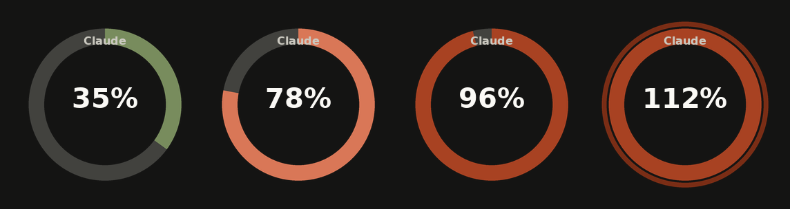

# Claude Usage — StreamController Plugin

A [StreamController](https://github.com/StreamController/StreamController) plugin that shows your **Claude Code** usage on a Stream Deck key as a Claude-branded progress ring. Two separate actions, one key each:

- **Claude Usage** — the current **5-hour session block**
- **Claude Weekly Usage** — the current week

It works by shelling out to [`ccusage`](https://github.com/ryoppippi/ccusage), a community CLI that reads Claude Code's local session logs (`~/.claude/projects/**/*.jsonl`) and reports token usage per 5-hour billing window. No API key or login is needed — it only reads files that Claude Code already writes on your machine. This also picks up usage from any tool that shells out to the real `claude` CLI under the hood (e.g. the [Claudian](https://github.com/YishenTu/claudian) Obsidian plugin), not just the terminal.



> **Disclaimer:** This plugin — code, README, and assets — was written by [Claude Code](https://claude.com/claude-code), Anthropic's AI coding agent, based on prompts from the repo owner. It has been tested on a real StreamController install, but review it yourself before trusting it, especially the parts that run shell commands. Issues and PRs are welcome.

## What it shows

Both actions share the same look — a Claude-branded progress ring, only drawn once you've set a token limit (see [Configuration](#configuration); otherwise the key falls back to the plain plugin icon), a top label, a center label with the percentage or raw token count, and a bottom label with time remaining (or cost, if enabled). Pressing either key forces an immediate refresh.

### Claude Usage (5-hour block)

- **Progress ring:** fills clockwise from the top as you use up the current 5-hour block — sage green < 70 %, Claude orange 70–90 %, rust ≥ 90 %, with a darker rust outer ring past 100 %.
- **Bottom label:** time remaining in the current 5-hour block (e.g. `2h 15m left`), or the block's cost in USD.
- If there's no active session right now, it shows "No active block".

### Claude Weekly Usage

- Same ring/percentage behavior, but aggregated over the current week (`ccusage weekly`) instead of the active 5-hour block.
- **Bottom label:** time remaining until the week rolls over (e.g. `3d 14h left`), or the week's cost in USD.
- Has its own token limit and its own "week starts on" setting, independent of the 5-hour action.

> **Note on accuracy:** the percentage on both actions is an *estimate* based on local token counts, not the authoritative number Anthropic's servers use internally. For the 5-hour block, Anthropic's real limit also factors in compute time and per-plan/per-account details. For the weekly action, it's a rougher estimate still — Anthropic's actual weekly cap is described as being based on active compute time, not raw tokens, and `ccusage weekly` has no way to know which day of the week *your* account's limit actually resets on (see the "week starts on" setting). Treat both as helpful gauges, not precise readouts. Neither can see Claude.ai / Claude Desktop usage, since those don't write the same local session logs.

## Requirements

- StreamController (Flatpak or native install both work)
- Something that can run `ccusage`: [Node.js](https://nodejs.org/) (for `npx`) or [Bun](https://bun.sh/) — most Claude Code users already have one of these installed
- Local Claude Code usage logs on the same machine (i.e. you actually run `claude` on this computer)

By default the plugin invokes `npx --yes ccusage@latest`, so there's nothing extra to install — the first run downloads `ccusage` and caches it. If you'd rather not hit the network on every refresh, install it once globally (`npm install -g ccusage`) and change the command in the plugin settings to just `ccusage`.

## Installation

### From the StreamController Store

Search for **Claude Usage** in StreamController's built-in store and install it from there. 

### Manually

1. Clone or copy this folder somewhere on your machine.
2. Run the installer, which symlinks it into StreamController's plugin directory:
   ```bash
   ./install.sh
   ```
   This detects both the Flatpak install (`~/.var/app/com.core447.StreamController/data/plugins/`) and a native install (`~/.local/share/StreamController/plugins/`). If your setup differs, symlink the folder into your plugins directory manually.
3. Restart StreamController.
4. Open a key's action picker, find **Claude Usage** and/or **Claude Weekly Usage**, and add it to a key. They're independent — you can use either one alone, or both on different keys.

## Configuration

Click a key's action in StreamController to open its settings.

**Claude Usage:**

| Setting | Default | Description |
| --- | --- | --- |
| ccusage command | `npx --yes ccusage@latest` | How to invoke ccusage. Use `ccusage` if you installed it globally, or `bunx ccusage` for Bun. |
| Token limit for 100% | `0` | Tokens that count as your plan's full 5-hour limit. Leave at `0` to just show the raw token count instead of a percentage — useful since Anthropic doesn't publish exact per-plan token limits; you can approximate yours by watching `ccusage blocks --recent` over a few sessions and setting it close to what you've observed. |
| Refresh interval | `60` seconds | How often the key updates in the background (minimum 15s). |
| Show cost instead of time remaining | off | Swap the bottom label to the block's USD cost. |

**Claude Weekly Usage:** same `ccusage command`, `Refresh interval`, and cost toggle as above, plus:

| Setting | Default | Description |
| --- | --- | --- |
| Token limit for 100% | `0` | Same idea as the 5-hour action, but for your weekly total. Run `ccusage weekly --recent` over a few weeks to get a feel for a reasonable value. |
| Week starts on | `Sunday` | Which weekday `ccusage` treats as the start of the week. Set this to whatever day your account's weekly limit actually resets on, if you know it (e.g. from a "resets Tuesday" message in Claude Code) — it won't be correct by default. |

## How it works

Every refresh interval (and once immediately on key press), a background thread runs one of:

```bash
<command> blocks --active --json --offline
<command> weekly --json --offline --last 1 -w <week-starts-on>
```

**Claude Usage** parses the active block's token counts (`inputTokens` + `outputTokens` + `cacheCreationInputTokens` + `cacheReadInputTokens`) and its `endTime`. **Claude Weekly Usage** parses the current week's `totalTokens` and derives the week's end from its `week` start date (always exactly 7 days). Both compute a percentage and a time-remaining string the same way, and share the ring-drawing code.

The ring is drawn with Pillow (already a StreamController dependency) at 4x resolution and downsampled for smooth edges, then set as the key's media. The UI update is marshalled back onto the main thread via `GLib.idle_add`, so a slow `ccusage` invocation never blocks StreamController.

On a Flatpak install, the command runs via `flatpak-spawn --host` (with the working directory pinned to `$HOME`) so it executes on the host system where Node/`ccusage` actually live, rather than inside the sandbox.

## Troubleshooting

Check the log for errors, filtering to just this plugin:

```bash
# Flatpak
grep -E "Claude(Weekly)?Usage" ~/.var/app/com.core447.StreamController/data/logs/logs.log
# native
grep -E "Claude(Weekly)?Usage" ~/.local/share/StreamController/logs/logs.log
```

- **`No module named 'actions.ClaudeUsage'` / action missing entirely:** you're on an old copy of the plugin — `git pull` and restart StreamController.
- **Key shows "!" / "ccusage error":** the `[ClaudeUsage] ...` or `[ClaudeWeeklyUsage] ...` line right above it in the log has the actual failure. Test the command by hand first: `npx --yes ccusage@latest blocks --active --json --offline` (or `weekly --json --offline --last 1 -w sunday` for the weekly action).
- **`Portal call failed: Failed to start command` (Flatpak):** already fixed as of 1.1.0 — make sure you're on the latest version.
- Full step-by-step install walkthrough is in [Installation](#installation); for a token-limit starting point run `npx --yes ccusage@latest blocks --recent` and use the highest "Total Tokens" you've seen.

## Contributing

Issues and PRs welcome. This repo already ships everything the [store submission process](https://streamcontroller.github.io/docs/latest/plugin_dev/intro/) expects — `manifest.json` (with a `github` field), `about.json`, `attribution.json`, `requirements.txt`, the `store/` thumbnail, and `.github/workflows/notify-store.yml` (needs a `STORE_AUTOMATION_TOKEN` once accepted). What's still open, and has to come from whoever submits it (it's a personal attestation to Core447's store terms, tied to your own GitHub account):

1. Fork [StreamController-Store](https://github.com/StreamController/StreamController-Store).
2. Add an entry to `Plugins.json`:
   ```json
   {
       "url": "https://github.com/ENjxzlt/Claude-Code-Usage-Streamcontroller",
       "commits": {
           "1.5.0-beta": "<commit hash of the release you tested against>"
       }
   }
   ```
3. Open a PR against the Store repo and wait for approval (usually a couple of hours).

## License

[GPL-3.0](LICENSE), matching StreamController itself. See [`attribution.json`](attribution.json) and the `Attribution.txt` files under `assets/` and `store/` for asset credits.
